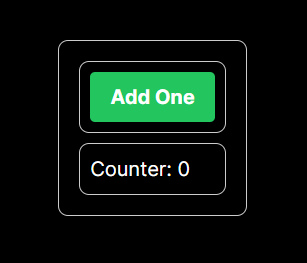
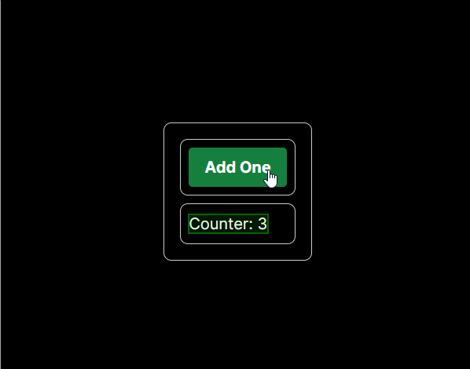
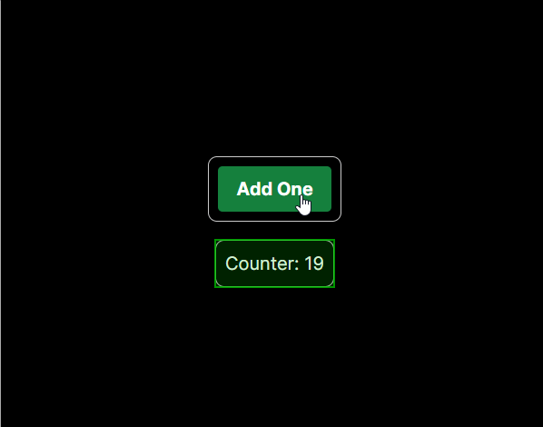
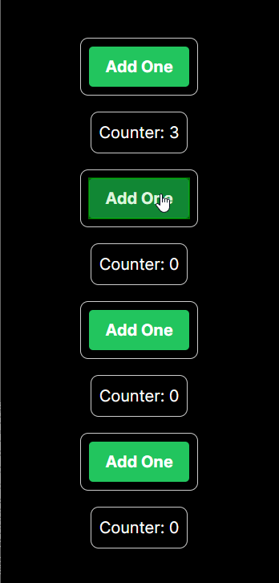

# Découverte de React `Context`

A la fin de cet exercice vous connaîtrez les bases des `Context`, vous permettant ainsi de partager des états dans une grape de composants.

## Partie 1 : Créer mon template

### La TODO

1. Créer une application react avec vite et typescript
3. Créer un composant comportant :
   1. un bouton `Add`
   2. un compteur `Counter`

### Résultat attendu

Lorsque vous irez sur la home page de votre application, vous devriez avoir un bouton `Add` et un compteur `Counter` initialisé à `0`.

```tsx
const Counter = ({ value }) => (
   <div>
      <span>Counter: {value}</span>
   </div>
)

const CounterContainer = ()=> (
   <div>
      <button>Add</button>
      <Counter value={0} />
   </div>
)
```


## Partie 2 : Ajouter un `state` au composant `Counter`

### La TODO

1. Ajouter un `state` au composant `Counter` pour stocker la valeur du compteur
2. Affecter la valeur du compteur à la propriété `value` du composant `Counter`
3. Afficher la valeur du compteur dans le composant `Counter`
4. Ajouter le comportement suivant au bouton `Add` :
   1. Incrémenter la valeur du compteur de 1
   2. Mettre à jour la valeur du compteur dans le composant `Counter`

### Résultat attendu

Maintenant que vous avez un `state` dans votre composant `Counter`, vous devriez voir la valeur du compteur s'incrémenter à chaque fois que vous cliquez sur le bouton `Add`.

```tsx
const Counter = ({ value } : { value: number }) => (
   <div>
      <span>Counter: { value }</span>
   </div>
)

import { useState, Dispatch, SetStateAction } from "react"

const AddButton = ({ setCounter }: Dispatch<SetStateAction<number>>)=> (
   <button onClick={(e)=> setCounter((v:number) => v + 1)}>Add</button>
)

const CounterContainer = ()=> {
   const [counter, setCounter] = useState(0)

   return (
      <div>
         <AddButton setCounter={ setCounter } />
         <Counter value={ counter } />
      </div>
   )
}
```



## Partie 3 : Contourner le `props drilling`

Un des soucis avec le state management est qu'avec React, il faut passer par les `props` pour transmettre des données entre les composants. Cela peut vite devenir problématique lorsque l'on a des composants qui sont éloignés dans l'arbre des composants.

Pour contourner ce problème, React propose les `Context`. Les `Context` permettent de créer un état global à l'application, qui sera accessible par tous les composants de l'application.

### La TODO

1. Créer un `Context` pour stocker la valeur du compteur
2.  Ajouter un `Provider` autour du composant `CounterContainer` pour fournir la valeur du compteur à tous les composants de l'application
3. Remplacer la valeur du compteur dans le composant `Counter` par la valeur du `Context`
4. Remplacer le `state` du composant `Counter` par la valeur du `Context`

### Résultat attendu

Vous devriez voir la valeur du compteur s'incrémenter à chaque fois que vous cliquez sur le bouton `Add`.

```tsx
// ./src/CounterContext.ts
type ContextType = [number, Dispatch<SetStateAction<number>>] | null | undefined;

export const CounterContext = createContext<ContextType>(null)

// ./src/CounterContextProvider.tsx

import { CounterContext } from "./CounterContext"

const CounterContextProvider = ({ children }: { children: ReactNode }) => {
   return (
      <CounterContext.Provider value={useState(0)}>
         {children}
      </CounterContext.Provider>
   )
}

// ./src/Counter.tsx

import { useContext } from "react"
import { CounterContext } from "./CounterContext"

const Counter = () => {
   const [counter] = useContext(CounterContext)

   return (
      <div>
         <span>Counter: { counter }</span>
      </div>
   )
}


// ./src/AddButton.tsx

import { useContext } from "react"
import { CounterContext } from "./CounterContext"

const AddButton = ()=> {
   const [, setCounter] = useContext(CounterContext)

   return (
      <button onClick={(e)=> setCounter((v:number) => v + 1)}>Add</button>
   )
}

// ./src/CounterContainer.tsx

import { Counter } from "./Counter"
import { AddButton } from "./AddButton"

const CounterContainer = ()=> (
   <div>
      <AddButton />
      <Counter />
   </div>
)

// ./src/App.tsx

import { CounterContextProvider } from "./CounterContextProvider"
import { CounterContainer } from "./CounterContainer"

const App = ()=> (
   <CounterContextProvider>
      <CounterContainer />
   </CounterContextProvider>
)
```



L'avantage des `Context` est que l'on peut créer autant de `Context` que l'on veut. Cela permet de découper son application en plusieurs `Context` et ainsi de ne pas avoir un `Context` trop gros.

Cela permet également de ne pas avoir à passer par les `props` pour transmettre des données entre les composants.

Dans l'exemple suivant, dans la page nous avons deux composants `CounterContainer` qui ont chacun leur propre `Context` pour stocker la valeur du compteur. Nous avons également des composants partageant le même `context`.

```tsx
// ./src/App.tsx

import { CounterContextProvider } from "./CounterContextProvider"
import { CounterContainer } from "./CounterContainer"

const IsolatedComponent = () => {
   return (
      <CounterContextProvider>
         <CounterContainer />
      </CounterContextProvider>
   )
}

const SharedContextComponent = () => {
   return (
      <CounterContextProvider>
         <CounterContainer />
         <CounterContainer />
      </CounterContextProvider>
   )
}

const App = ()=> (
   <>
      <IsolatedComponent />
      <IsolatedComponent />
      <SharedContextComponent />
   </>
)
```



# Bon courage !