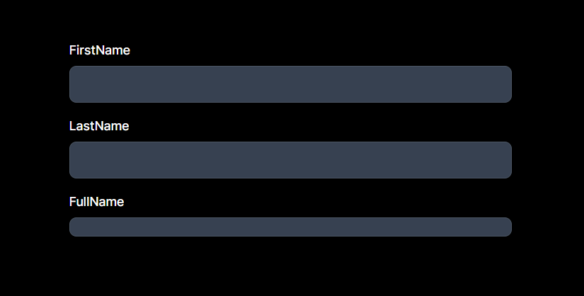
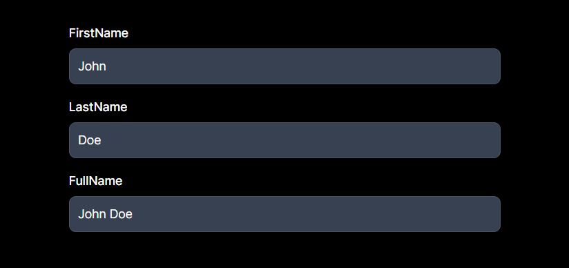
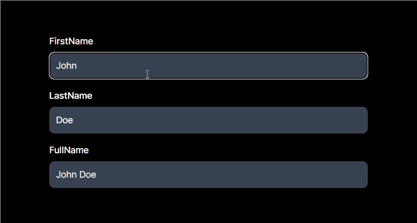
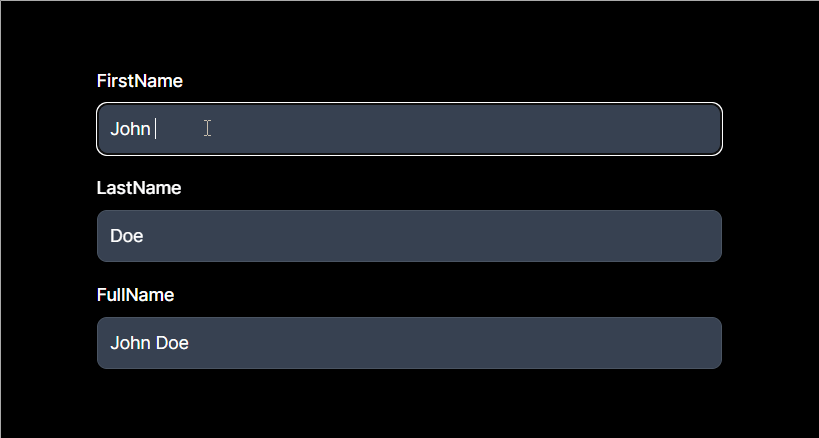
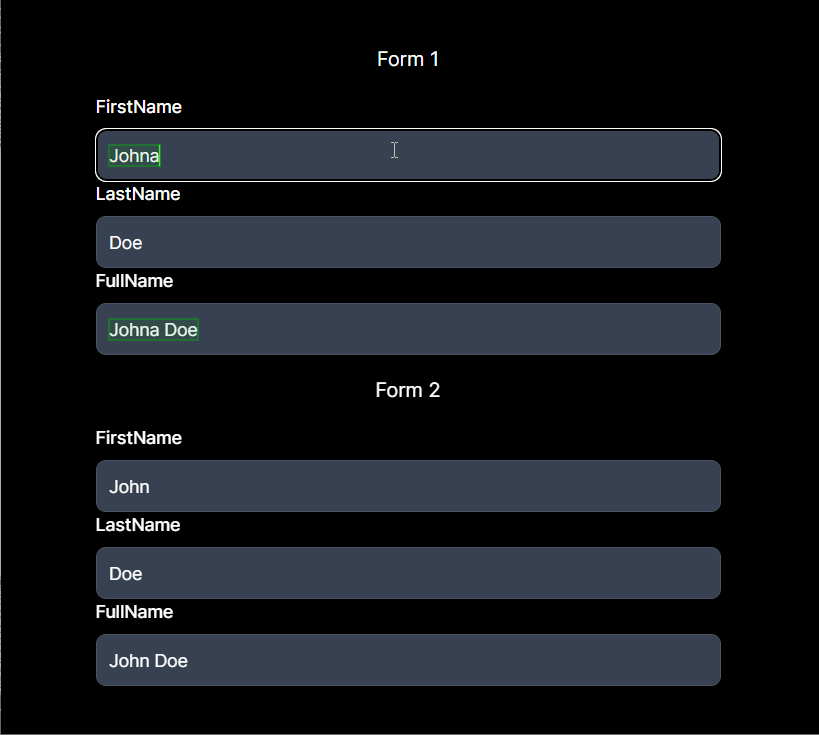

# Découverte de Legend App

A la fin de cet exercice vous connaîtrez les bases de Legend App, vous permettant ainsi de créer des `observables`.

## Partie 1 : Créer mon template

### La TODO

1. Créer une application react avec vite et typescript
```sh
$ yarn create vite legend-app --template react-ts
```
2. Installer les dépendances `@legendapp/state`
```sh
$ yarn add @legendapp/state
```
3. Créer un composant comportant :
   1. un formulaire avec un champ `input` et un `label` pour des champs :
      1. firstname
      2. lastname
      3. Une concaténation des deux précédentes valeurs

```tsx
<main>
   <div>
      <label htmlFor='firstname'>FirstName</label>
      <input type="text" name="firstname" />
   </div>
   <div>
      <label htmlFor='lastname'>LastName</label>
      <input type="text" name="lastname" />
   </div>
   <div>
      <label htmlFor='fullname'>FullName</label>
      <span>
      { } { }
      </span>
   </div>
</main>
```

### Résultat attendu
Lorsque vous irez sur la home page de votre application, vous devriez avoir :



## Partie 2 : Ajouter son premier `observable`

### La TODO

1. Utiliser le hook `useObservable` pour créer un observable `person`, composé des champs `firstname` et `lastname`, avec comme valeur par défaut `John` et `Doe`
2. Affecter les valeurs des champs `firstname` et `lastname` aux champs correspondants du formulaire
3. Brancher le champ `fullname` à l'observable `person`
4. Ajouter le gestionnaire d'événement `onChange` sur les champs `firstname` et `lastname` pour mettre à jour l'observable `person`

```tsx
'use client' //important si vous êtes sur react 18+ (React Server Components)

import {useObservable} from '@legendapp/state/react';

const Component = ()=> {

   const person = useObservable({
      firstname: 'John',
      lastname: 'Doe',
   });

   return (
      <main>
         <div>
            <label htmlFor='firstname'>FirstName</label>
            <input 
               type="text" 
               name="firstname" 
               value={person.firstname.get()} 
               onChange={(e) => person.firstname.set(e.target.value)} />
         </div>
         <div>
            <label htmlFor='lastname'>LastName</label>
            <input 
               type="text" 
               name="lastname" 
               value={person.lastname.get()} 
               onChange={(e) => person.lastname.set(e.target.value)} />
         </div>
         <div>
            <label htmlFor='fullname'>FullName</label>
            <span>
            { person.firstname.get() } { person.lastname.get() }
            </span>
         </div>
      </main>
   )
}

export default Component;
```

### Résultat attendu

Une fois cette partie effectuée, vous devriez avoir un formulaire avec des valeurs par défaut mais lorsque vous éditez un champs, rien ne se passe.



## Partie 3 : Faire que son composant soit `aware`

### La TODO

1. Importer la dépendance `observer`
```tsx
import { observer } from '@legendapp/state/react';
```
2. Entourer le composant avec le `observer`
```tsx
export default observer(Component);
```

### Résultat attendu 

Maintenant tout est synchronisé avec l'observable `person`.



> 💡Il reste un soucis, dans cette configuration, si vous modifiez un champs, l'ensemble du formulaire se re-render. Pour éviter cela, il faut partager l'observable `person` entre les différents composants.

## Partie 4 : Partager un observable

### La TODO

1. Créer un composant `Firstname` avec un champ `input` et un `label` pour le champ `firstname`

Dans un premier temps, créer l'interface `FieldProps` pour typer les props de nos futurs composante.

```tsx
// FieldProps.ts

import { ObservableObject } from '@legendapp/state';

export interface FieldProps {
   person: ObservableObject<{
      firstname: string;
      lastname: string;
   }>
} 
```

Ensuite, nous pouvons créer notre composant `Firstname`.

```tsx
const Firstname = ({ person }: FieldProps)=> {
   return (
      <div>
         <label htmlFor='firstname'>FirstName</label>
         <input 
            type="text" 
            name="firstname" 
            value={person.firstname.get()} 
            onChange={(e) => person.firstname.set(e.target.value)} />
      </div>
   )
}
```

2. Créer un composant `Lastname` avec un champ `input` et un `label` pour le champ `lastname`

```tsx
const Lastname = ({ person }: FieldProps)=> {
   return (
      <div>
         <label htmlFor='lastname'>LastName</label>
         <input 
            type="text" 
            name="lastname" 
            value={person.lastname.get()} 
            onChange={(e) => person.lastname.set(e.target.value)} />
      </div>
   )
}
```

3. Créer un composant `Fullname` avec un champ de concaténation pour les champs `firstname` et `lastname`

```tsx
const Fullname = ({ person }: FieldProps)=> {

   return (
      <div>
         <label htmlFor='fullname'>FullName</label>
         <span>
            { person.firstname.get() } { person.lastname.get() }
         </span>
      </div>
   )
}
```
4. Adapter l'appel des nouveaux composants au `Composant`

```tsx
'use client'

import {useObservable} from '@legendapp/state/react';

const Component = ()=> {

   const person = useObservable({
      firstname: 'John',
      lastname: 'Doe',
   });

   return (
      <main>
         <Firstname person={person} />
         <Lastname person={person} />
         <Fullname person={person} />
      </main>
   )
}

export default Component;
```

### Résultat attendu

Vous devriez avoir le même résultat qu'à la fin de la partie 2 mais de nouveau, la mise à jour des champs ne fonctionne pas. Pour remédier au problème, chacun des composants doit être `aware`. Un exemple avec le composant `Firstname` :

```tsx
import { observer } from '@legendapp/state/react';

const Firstname = observer(({ person }: FieldProps)=> {
   return (
      <div>
         <label htmlFor='firstname'>FirstName</label>
         <input 
            type="text" 
            name="firstname" 
            value={person.firstname.get()} 
            onChange={(e) => person.firstname.set(e.target.value)} />
      </div>
   )
})
```

Maintenant, tout fonctionne de nouveau. Si on active le highlight des rerenders, on peut voir que seul le composant `Firstname` et `Fullname` se re-renderent à la modif de `Firstname`.

> 🧩 Pour activer le highlight des rerenders, faire :
> * Options > More Tools > Rendering and select Paint Flashing from given options.



> 🍒 une option de Legend App permet de lier l'observable `person` au `state` des composants. 
>
>```tsx
>import { useObservable, enableLegendStateReact } from '@legendapp/state/react';
>
>enableLegendStateReact();
>
>const Component = ()=> {
>   [...]
>}
>```
>
> Vous pourrez donc faire dans `Fullname`: 
> ```tsx
> import { useObservable } from '@legendapp/state/react';
> 
> const Fullname = ({ person }: FieldProps)=> {
> 
>    return (
>       <div>
>          <label htmlFor='fullname'>FullName</label>
>          <span>
>             { person.firstname } { person.lastname } // plus besoin du .get() ni de l'observer
>          </span>
>       </div>
>    )
> }
> ```

## Partie 5 : Faire que son composant soit `aware`

### La TODO

1. Importer la dépendance `observer`
```tsx
import { observer } from '@legendapp/state/react';
```
2. Entourer le composant avec le `observer`
```tsx
export default observer(Component);
```

### Résultat attendu 

Maintenant tout est synchronisé avec l'observable `person`.


> 💡Il reste un soucis, dans cette configuration, si vous modifiez un champs, l'ensemble du formulaire se re-render. Pour éviter cela, il faut partager l'observable `person` entre les différents composants.

## Partie 6 : Partager via le `context`

Le but de cette partie est de pourvoir localiser l'impact des changements d'état. Si vous souhaitez créer deux formulaires dans votre composant, actuellement, ils vont partager le même état, ce qui n'est pas souhaitable. Pour cela, nous allons utiliser le `context` de React.

### La TODO

1. Créer un context `PersonContext` avec comme valeur par défaut l'observable `person`
   
```tsx
// ./PersonContext.tsx

import { createContext } from 'react';
import { ObservableObject } from '@legendapp/state';

export const PersonContext = createContext<ObservableObject<{
   firstname: string;
   lastname: string;
}>>({
   firstname: 'John',
   lastname: 'Doe',
});

export const usePersonContext = () => useContext(PersonContext);

export const contextFactory = ()=> {
   const first = useObservable('John')
   const last = useObservable('Doe')
   const full = useComputed(() => `${first.get()} ${last.get()}`)

   return {
      first,
      last,
      full,
   }
}
```

2. Créer un composant `Form` qui contiendra les composants `Firstname`, `Lastname` et `Fullname`.
```tsx

// ./Form.tsx

import { useObservable } from '@legendapp/state/react';
import { PersonContext, contextFactory } from './PersonContext';
import { Firstname } from './Firstname';
import { Lastname } from './Lastname';
import { Fullname } from './Fullname';

const Form = ()=> {
   return (
      <>
         <PersonContext.Provider value={contextFactory()}>
         <Container />
         </PersonContext.Provider>
      </>
   )
}

// ./Container.tsx

const Container = ()=> {
   return (
      <>
         <Firstname />
         <Lastname />
         <Fullname />
      </>
   )
}

// ./Firstname.tsx

import { usePersonContext } from './PersonContext';

const Firstname = ()=> {
   const { first } = usePersonContext();
   return (
      <div>
         <label htmlFor='firstname'>FirstName</label>
         <input 
            type="text" 
            name="firstname" 
            value={first.get()} 
            onChange={(e) => first.set(e.target.value)} />
      </div>
   )
}
```
### Résultat attendu

Vous devriez avoir le même résultat qu'à la fin de la partie 5 à ceci près que vous pouvez créer plusieurs formulaires indépendants.

```tsx
// ./Component.tsx

import { Form } from './Form';

const Component = ()=> {
   return (
      <>
         <Form />
         <Form />
      </>
   )
}
```




That's all folks !
